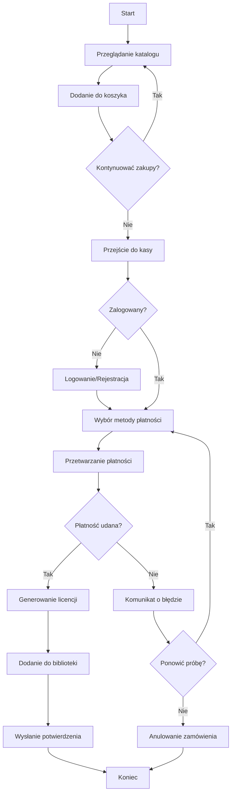
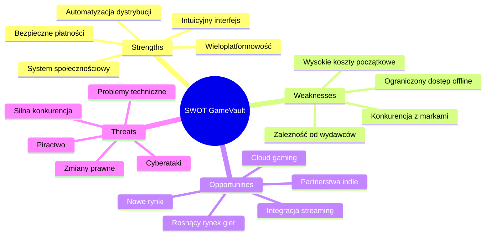
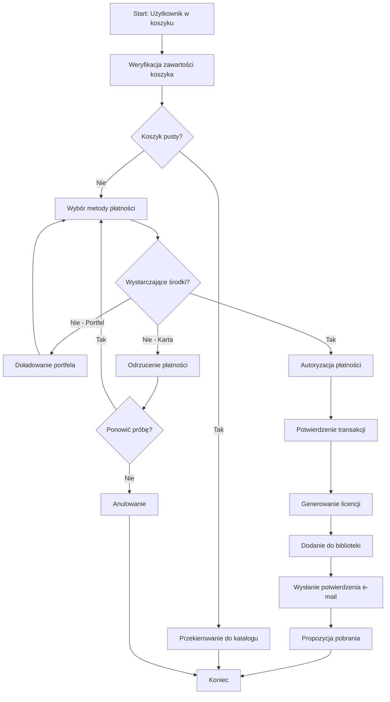
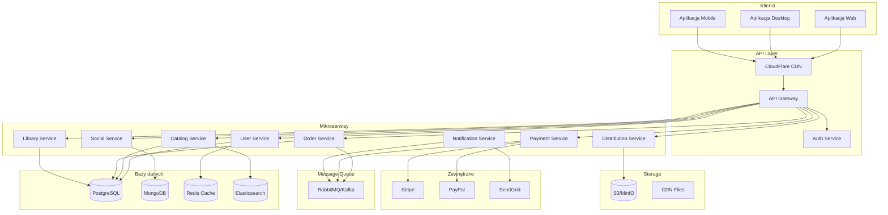
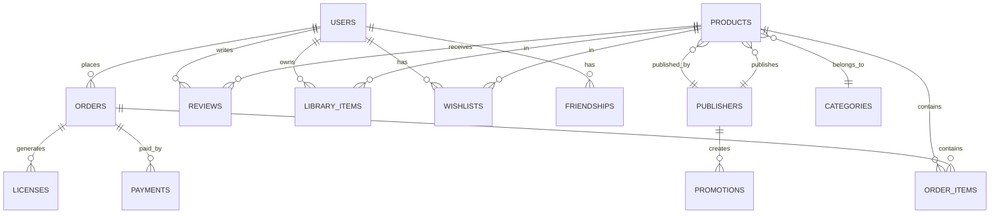
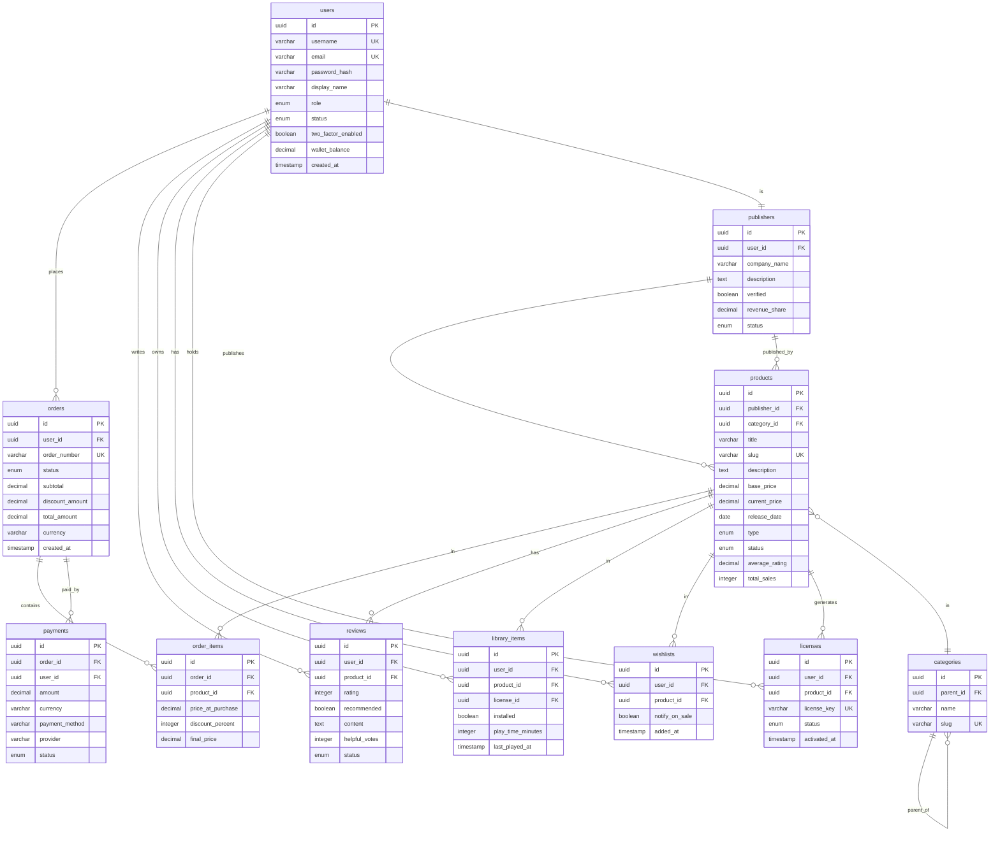

# Dokumentacja Projektu: Sklep Online z Oprogramowaniem "GameVault"

**Wersja dokumentu:** 1.0  
**Data:** Styczeń 2026  
**Autorzy:** Zespół Projektowy

---

## Spis treści

1. [ARTYKUŁ I. PROJEKT](#artykuł-i-projekt)
2. [ARTYKUŁ II. ANALIZA KWESTII](#artykuł-ii-analiza-kwestii)
3. [ARTYKUŁ III. PROJEKT SYSTEMU](#artykuł-iii-projekt-systemu)
4. [ARTYKUŁ IV. SCHEMAT UML](#artykuł-iv-schemat-uml)
5. [ARTYKUŁ V. PROGRAMOWANIE I IMPLEMENTACJA](#artykuł-v-programowanie-i-implementacja)
6. [ARTYKUŁ VI. PODSUMOWANIE](#artykuł-vi-podsumowanie)

---

# ARTYKUŁ I. PROJEKT

## 1.1 Przedmiot projektu

**System sprzedaży i dystrybucji oprogramowania online dla platformy "GameVault".**

Projekt ma na celu stworzenie kompleksowej platformy internetowej umożliwiającej użytkownikom zakup, pobieranie i zarządzanie licencjami na oprogramowanie, w szczególności gry komputerowe. "GameVault" stawia na wygodę użytkownika, bezpieczeństwo transakcji oraz nowoczesne rozwiązania technologiczne.

Aplikacja będzie dostępna jako:
- Aplikacja webowa (responsywna)
- Aplikacja desktopowa (Windows, macOS, Linux)
- Aplikacja mobilna (iOS, Android) - do zarządzania kontem

System pozwala użytkownikom na:
- Przeglądanie i zakup oprogramowania
- Pobieranie i aktualizowanie zakupionych produktów
- Zarządzanie biblioteką gier
- Uczestnictwo w społeczności (recenzje, osiągnięcia, lista znajomych)
- Korzystanie z promocji i wyprzedaży

Administratorzy i wydawcy otrzymają narzędzia do:
- Zarządzania katalogiem produktów
- Monitorowania sprzedaży
- Zarządzania promocjami
- Moderacji treści społeczności

## 1.2 Zakres projektu

1. **Automatyzacja procesu zakupu i dystrybucji** – Umożliwienie klientom natychmiastowego dostępu do zakupionego oprogramowania poprzez system kluczy licencyjnych i pobierania.

2. **Zarządzanie biblioteką użytkownika** – Centralne miejsce do zarządzania wszystkimi zakupionymi produktami, ich instalacją, aktualizacjami i usuwaniem.

3. **Integracja z systemami płatności** – Zapewnienie bezpiecznych i różnorodnych metod płatności online (karty, PayPal, BLIK, kryptowaluty).

4. **System społecznościowy** – Funkcjonalności takie jak lista znajomych, osiągnięcia, recenzje, forum dyskusyjne i grupy tematyczne.

5. **Panel wydawcy** – Narzędzia dla wydawców do publikowania i zarządzania swoimi produktami, analizy sprzedaży i interakcji z użytkownikami.

6. **System promocji i rabatów** – Mechanizmy wyprzedaży sezonowych, kuponów rabatowych, pakietów promocyjnych.

7. **Analiza i raportowanie** – Zaawansowane narzędzia analityczne dla administratorów i wydawców.

## 1.3 Struktura dokumentu

Dokument został podzielony na sześć głównych artykułów tematycznych:
- **Artykuł I** – Wprowadzenie do projektu i analiza strategiczna
- **Artykuł II** – Analiza wymagań funkcjonalnych i niefunkcjonalnych
- **Artykuł III** – Projekt techniczny systemu
- **Artykuł IV** – Schematy UML i modelowanie
- **Artykuł V** – Plan implementacji i testowania
- **Artykuł VI** – Podsumowanie projektu

## 1.4 Terminologia i definicje

| Termin | Definicja |
|--------|-----------|
| **Użytkownik** | Osoba korzystająca z platformy "GameVault" w celu zakupu lub korzystania z oprogramowania |
| **Administrator** | Osoba upoważniona do zarządzania systemem, odpowiedzialna za moderację i konfigurację platformy |
| **Wydawca** | Firma lub osoba fizyczna publikująca oprogramowanie na platformie |
| **Deweloper** | Twórca oprogramowania, może być powiązany z wydawcą lub działać niezależnie |
| **Biblioteka** | Zbiór wszystkich produktów zakupionych przez użytkownika |
| **Klucz licencyjny** | Unikalny kod aktywacyjny przypisany do zakupionego produktu |
| **DRM** | Digital Rights Management - system zabezpieczeń chroniący oprogramowanie |
| **Koszyk** | Tymczasowe miejsce przechowywania produktów wybranych do zakupu |
| **Lista życzeń** | Lista produktów, które użytkownik zamierza zakupić w przyszłości |
| **Osiągnięcie** | Wirtualna nagroda przyznawana za wykonanie określonych zadań |
| **Recenzja** | Opinia użytkownika na temat produktu, zawierająca ocenę i komentarz |
| **Kurator** | Użytkownik lub grupa tworząca rekomendacje produktów |
| **Warsztat** | Sekcja umożliwiająca udostępnianie modyfikacji tworzonych przez użytkowników |
| **Zwrot** | Proces oddania zakupionego produktu i otrzymania zwrotu środków |
| **Portfel** | Wirtualne konto środków użytkownika na platformie |

## 1.5 Logo

Koncepcja logo systemu "GameVault":

```
   ╔══════════════════════════════════════╗
   ║                                      ║
   ║    🎮  G A M E V A U L T  🔐        ║
   ║                                      ║
   ║      Your Digital Game Vault         ║
   ║                                      ║
   ╚══════════════════════════════════════╝
```

Logo przedstawia połączenie symbolu kontrolera gier z motywem sejfu/skarbca, symbolizując bezpieczne przechowywanie cyfrowej kolekcji gier użytkownika.

## 1.6 Proces realizacji zamówienia

Proces realizacji zamówienia odbywa się elektronicznie i składa się z następujących kroków:

1. Użytkownik przegląda katalog produktów
2. Użytkownik dodaje produkty do koszyka
3. Użytkownik przechodzi do realizacji zamówienia
4. System weryfikuje konto użytkownika (logowanie lub rejestracja)
5. Użytkownik wybiera metodę płatności
6. System przetwarza płatność
7. Po pomyślnej płatności system generuje klucze licencyjne
8. Produkty zostają dodane do biblioteki użytkownika
9. Użytkownik otrzymuje potwierdzenie zakupu na e-mail
10. Użytkownik może pobrać i zainstalować zakupione produkty

```mermaid
gantt
    title Proces realizacji zamówienia
    dateFormat  HH:mm
    axisFormat %H:%M
    
    section Przeglądanie
    Przeglądanie katalogu           :a1, 00:00, 3m
    Dodanie do koszyka              :a2, after a1, 1m
    
    section Zakup
    Przejście do kasy               :b1, after a2, 1m
    Logowanie/Rejestracja           :b2, after b1, 2m
    Wybór płatności                 :b3, after b2, 1m
    
    section Finalizacja
    Przetwarzanie płatności         :c1, after b3, 1m
    Generowanie licencji            :c2, after c1, 1m
    Dodanie do biblioteki           :c3, after c2, 1m
    Wysłanie potwierdzenia          :c4, after c3, 1m
```





## 1.7 Analiza SWOT

### Szczegółowa analiza SWOT:



| **MOCNE STRONY (Strengths)** | **SŁABE STRONY (Weaknesses)** |
|------------------------------|-------------------------------|
| Intuicyjny i nowoczesny interfejs użytkownika | Wysokie koszty początkowe wdrożenia |
| Automatyzacja procesu dystrybucji | Zależność od zewnętrznych wydawców |
| Rozbudowany system społecznościowy | Ograniczony dostęp offline |
| Wieloplatformowość (Web, Desktop, Mobile) | Konkurencja z uznanymi markami |
| Bezpieczny system płatności | Konieczność ciągłego wsparcia technicznego |

| **SZANSE (Opportunities)** | **ZAGROŻENIA (Threats)** |
|---------------------------|--------------------------|
| Rosnący rynek gier cyfrowych | Silna konkurencja (Steam, Epic, GOG) |
| Rozwój technologii cloud gaming | Ryzyko problemów technicznych |
| Możliwość ekspansji na nowe rynki | Zmiany w przepisach prawnych |
| Partnerstwa z wydawcami indie | Piractwo i łamanie zabezpieczeń |
| Integracja z platformami streamingowymi | Cyberataki i naruszenia bezpieczeństwa |

---

# ARTYKUŁ II. ANALIZA KWESTII

## 2.1 Wymagania funkcjonalne

### 2.1.1 Opis funkcji użytkownika

| ID | Funkcja | Opis |
|----|---------|------|
| F01 | Rejestracja konta | Użytkownicy mogą założyć konto poprzez formularz lub OAuth |
| F02 | Logowanie i zarządzanie kontem | Uwierzytelnianie, reset hasła, 2FA, aktualizacja danych |
| F03 | Przeglądanie katalogu | Wyszukiwanie, filtrowanie, sortowanie produktów |
| F04 | Zakup produktów | Dodawanie do koszyka, wybór płatności, finalizacja |
| F05 | Zarządzanie biblioteką | Przeglądanie zakupionych produktów, instalacja, aktualizacje |
| F06 | Lista życzeń | Dodawanie/usuwanie produktów, powiadomienia o promocjach |
| F07 | System recenzji | Wystawianie ocen, pisanie recenzji, głosowanie |
| F08 | Społeczność | Lista znajomych, wiadomości, grupy, forum |
| F09 | Osiągnięcia | Zdobywanie i przeglądanie osiągnięć |
| F10 | Portfel | Doładowanie środków, historia transakcji |
| F11 | Zwroty | Składanie wniosków o zwrot zgodnie z polityką |
| F12 | Powiadomienia | E-mail i push o promocjach, aktualizacjach |

### 2.1.2 Opis funkcji wydawcy

| ID | Funkcja | Opis |
|----|---------|------|
| F13 | Panel wydawcy | Dostęp do narzędzi zarządzania produktami |
| F14 | Publikacja produktów | Dodawanie nowych gier z opisami, mediami, cenami |
| F15 | Zarządzanie cenami | Ustalanie cen, tworzenie promocji, pakietów |
| F16 | Analityka | Raporty sprzedaży, statystyki użytkowników |
| F17 | Aktualizacje | Publikowanie patchy i aktualizacji produktów |
| F18 | Komunikacja | Odpowiadanie na recenzje, forum wsparcia |

### 2.1.3 Opis funkcji administratora

| ID | Funkcja | Opis |
|----|---------|------|
| F19 | Zarządzanie użytkownikami | Blokowanie, usuwanie kont, nadawanie uprawnień |
| F20 | Moderacja treści | Przeglądanie i usuwanie nieodpowiednich recenzji/postów |
| F21 | Zarządzanie katalogiem | Zatwierdzanie nowych produktów, edycja kategorii |
| F22 | Konfiguracja promocji | Tworzenie wyprzedaży sezonowych, kuponów |
| F23 | Raportowanie | Generowanie raportów systemowych, finansowych |
| F24 | Zarządzanie systemem | Konfiguracja parametrów platformy, backup |

### 2.1.4 Scenariusze użytkownika

**Użytkownik:**
- Jako użytkownik chcę przeglądać katalog gier, aby znaleźć interesujące tytuły
- Jako użytkownik chcę zakupić grę i natychmiast ją pobrać
- Jako użytkownik chcę dodawać gry do listy życzeń
- Jako użytkownik chcę wystawiać recenzje
- Jako użytkownik chcę zarządzać listą znajomych
- Jako użytkownik chcę korzystać z portfela
- Jako użytkownik chcę móc zwrócić grę

**Wydawca:**
- Jako wydawca chcę publikować swoje gry na platformie
- Jako wydawca chcę analizować statystyki sprzedaży
- Jako wydawca chcę tworzyć promocje
- Jako wydawca chcę odpowiadać na recenzje

**Administrator:**
- Jako administrator chcę zarządzać użytkownikami
- Jako administrator chcę moderować treści
- Jako administrator chcę konfigurować promocje globalne

## 2.2 Wymagania niefunkcjonalne

### 2.2.1 Wymagania wydajnościowe

| ID | Wymaganie | Metryka |
|----|-----------|---------|
| NF01 | Czas odpowiedzi API | < 200ms dla 95% żądań |
| NF02 | Czas ładowania strony | < 3 sekundy |
| NF03 | Współbieżność użytkowników | Min. 100 000 aktywnych sesji |
| NF04 | Przepustowość pobierania | Min. 100 Mbps na użytkownika |
| NF05 | Dostępność systemu | 99.9% uptime |
| NF06 | Czas przetwarzania płatności | < 5 sekund |

### 2.2.2 Wymagania bezpieczeństwa

| ID | Wymaganie | Opis |
|----|-----------|------|
| NF07 | Szyfrowanie danych | TLS 1.3 dla transmisji, AES-256 dla danych |
| NF08 | Uwierzytelnianie | OAuth 2.0, obsługa 2FA |
| NF09 | Zgodność PCI DSS | Dla przetwarzania płatności kartami |
| NF10 | Ochrona przed atakami | WAF, ochrona przed DDoS, SQL Injection, XSS |
| NF11 | Audyt bezpieczeństwa | Regularne testy penetracyjne |
| NF12 | RODO/GDPR | Pełna zgodność z przepisami |

### 2.2.3 Wymagania użyteczności

| ID | Wymaganie | Opis |
|----|-----------|------|
| NF13 | Responsywność | Pełna funkcjonalność na urządzeniach mobilnych |
| NF14 | Dostępność WCAG 2.1 | Poziom AA dla osób z niepełnosprawnościami |
| NF15 | Wielojęzyczność | Minimum 10 języków interfejsu |
| NF16 | Intuicyjność | Proces zakupu w max. 5 krokach |
| NF17 | Tryb ciemny/jasny | Możliwość wyboru motywu kolorystycznego |
| NF18 | Personalizacja | Rekomendacje oparte na preferencjach |

## 2.3 Diagram przypadków użycia

```mermaid
flowchart TB
    subgraph Aktorzy
        U((Użytkownik))
        W((Wydawca))
        A((Administrator))
        SP((System Płatności))
        SD((System Dystrybucji))
    end
    
    subgraph "System GameVault"
        subgraph "Moduł Konta"
            UC1[Rejestracja]
            UC2[Logowanie]
            UC3[Zarządzanie profilem]
            UC4[Weryfikacja 2FA]
        end
        
        subgraph "Moduł Katalogu"
            UC5[Przeglądanie katalogu]
            UC6[Wyszukiwanie produktów]
            UC7[Filtrowanie produktów]
            UC8[Przeglądanie szczegółów]
        end
        
        subgraph "Moduł Zakupów"
            UC9[Dodanie do koszyka]
            UC10[Zarządzanie koszykiem]
            UC11[Realizacja zamówienia]
            UC12[Dokonanie płatności]
        end
        
        subgraph "Moduł Biblioteki"
            UC13[Przeglądanie biblioteki]
            UC14[Pobieranie produktu]
            UC15[Instalacja produktu]
            UC16[Aktualizacja produktu]
        end
        
        subgraph "Moduł Społeczności"
            UC17[Dodawanie recenzji]
            UC18[Zarządzanie znajomymi]
            UC19[Wysyłanie wiadomości]
            UC20[Przeglądanie osiągnięć]
        end
        
        subgraph "Moduł Wydawcy"
            UC21[Publikacja produktu]
            UC22[Zarządzanie cenami]
            UC23[Analiza sprzedaży]
            UC24[Publikacja aktualizacji]
        end
        
        subgraph "Moduł Administracji"
            UC25[Zarządzanie użytkownikami]
            UC26[Moderacja treści]
            UC27[Konfiguracja promocji]
            UC28[Raportowanie systemowe]
        end
    end
    
    U --> UC1
    U --> UC2
    U --> UC5
    U --> UC9
    U --> UC11
    U --> UC13
    U --> UC14
    U --> UC17
    U --> UC18
    
    W --> UC21
    W --> UC22
    W --> UC23
    W --> UC24
    
    A --> UC25
    A --> UC26
    A --> UC27
    A --> UC28
    
    UC12 --> SP
    UC14 --> SD
    UC15 --> SD
```



## 2.4 Opis aktorów i użycie

### 2.4.1 Opis aktorów

**Aktorzy ożywieni:**

1. **Użytkownik** - Główny aktor systemu, osoba korzystająca z platformy w celu zakupu i korzystania z oprogramowania.

2. **Wydawca** - Firma lub osoba publikująca oprogramowanie na platformie.

3. **Administrator** - Osoba zarządzająca platformą, odpowiedzialna za moderację i konfigurację.

**Aktorzy nieożywieni:**

4. **System Płatności** - Zewnętrzny system realizujący transakcje płatnicze (Stripe, PayPal).

5. **System Dystrybucji** - CDN i serwery dystrybucyjne dostarczające pliki użytkownikom.

### 2.4.2 Użycie biznesowe

| Nazwa | Zakup i pobranie oprogramowania |
|-------|--------------------------------|
| **Warunki początkowe** | Użytkownik jest zalogowany i dodał produkt do koszyka |
| **Przebieg** | 1. Przejście do koszyka<br>2. Weryfikacja zawartości<br>3. Wybór metody płatności<br>4. Autoryzacja płatności<br>5. Potwierdzenie transakcji<br>6. Dodanie do biblioteki<br>7. Inicjacja pobierania |
| **Warunki końcowe** | Produkt dostępny w bibliotece, możliwość pobrania |
| **Przebiegi alternatywne** | - Brak środków: propozycja doładowania portfela<br>- Błąd płatności: ponowna próba lub inna metoda |



---

# ARTYKUŁ III. PROJEKT SYSTEMU

## 3.1 Architektura systemu

### 3.1.1 Opis ogólny architektury

System "GameVault" opiera się na architekturze mikroserwisowej:

1. **Warstwa prezentacji (Frontend)**
   - Aplikacja webowa (React/Next.js)
   - Aplikacja desktopowa (Electron)
   - Aplikacja mobilna (React Native)

2. **Warstwa API Gateway**
   - Routing żądań
   - Rate limiting
   - Uwierzytelnianie JWT

3. **Warstwa mikroserwisów (Backend)**
   - Serwis użytkowników
   - Serwis katalogu
   - Serwis zamówień
   - Serwis płatności
   - Serwis biblioteki
   - Serwis społeczności
   - Serwis dystrybucji

4. **Warstwa danych**
   - PostgreSQL (dane relacyjne)
   - MongoDB (dane dokumentowe)
   - Redis (cache, sesje)
   - Elasticsearch (wyszukiwanie)

### 3.1.2 Diagram architektury



## 3.2 Projekt bazy danych

### 3.2.1 Model koncepcyjny

Główne encje systemu:



### 3.2.2 Model logiczny

**Tabela: users (Użytkownicy)**

| Kolumna | Typ | Opis |
|---------|-----|------|
| id | UUID (PK) | Identyfikator użytkownika |
| username | VARCHAR(50) | Unikalna nazwa użytkownika |
| email | VARCHAR(100) | Adres e-mail |
| password_hash | VARCHAR(255) | Zahashowane hasło |
| display_name | VARCHAR(100) | Wyświetlana nazwa |
| avatar_url | VARCHAR(500) | URL do awatara |
| role | ENUM | user/publisher/admin |
| status | ENUM | active/suspended/deleted |
| two_factor_enabled | BOOLEAN | Czy włączone 2FA |
| wallet_balance | DECIMAL(10,2) | Saldo portfela |
| created_at | TIMESTAMP | Data utworzenia |
| updated_at | TIMESTAMP | Data aktualizacji |

**Tabela: products (Produkty)**

| Kolumna | Typ | Opis |
|---------|-----|------|
| id | UUID (PK) | Identyfikator produktu |
| publisher_id | UUID (FK) | ID wydawcy |
| title | VARCHAR(200) | Tytuł produktu |
| slug | VARCHAR(200) | URL-friendly nazwa |
| description | TEXT | Pełny opis |
| base_price | DECIMAL(10,2) | Cena bazowa |
| current_price | DECIMAL(10,2) | Aktualna cena |
| release_date | DATE | Data premiery |
| category_id | UUID (FK) | ID kategorii |
| type | ENUM | game/software/dlc |
| status | ENUM | draft/pending/active/removed |
| average_rating | DECIMAL(3,2) | Średnia ocen |
| total_sales | INTEGER | Liczba sprzedaży |
| created_at | TIMESTAMP | Data utworzenia |

**Tabela: orders (Zamówienia)**

| Kolumna | Typ | Opis |
|---------|-----|------|
| id | UUID (PK) | Identyfikator zamówienia |
| user_id | UUID (FK) | ID użytkownika |
| order_number | VARCHAR(20) | Numer zamówienia |
| status | ENUM | pending/paid/completed/refunded |
| subtotal | DECIMAL(10,2) | Suma przed rabatem |
| discount_amount | DECIMAL(10,2) | Kwota rabatu |
| total_amount | DECIMAL(10,2) | Suma końcowa |
| currency | VARCHAR(3) | Waluta |
| created_at | TIMESTAMP | Data utworzenia |

**Tabela: licenses (Licencje)**

| Kolumna | Typ | Opis |
|---------|-----|------|
| id | UUID (PK) | Identyfikator licencji |
| user_id | UUID (FK) | ID użytkownika |
| product_id | UUID (FK) | ID produktu |
| license_key | VARCHAR(50) | Klucz licencyjny |
| status | ENUM | active/revoked/transferred |
| activated_at | TIMESTAMP | Data aktywacji |
| created_at | TIMESTAMP | Data utworzenia |

**Tabela: reviews (Recenzje)**

| Kolumna | Typ | Opis |
|---------|-----|------|
| id | UUID (PK) | Identyfikator recenzji |
| user_id | UUID (FK) | ID użytkownika |
| product_id | UUID (FK) | ID produktu |
| rating | INTEGER | Ocena (1-10) |
| recommended | BOOLEAN | Czy poleca |
| title | VARCHAR(200) | Tytuł recenzji |
| content | TEXT | Treść recenzji |
| helpful_votes | INTEGER | Głosy "pomocne" |
| status | ENUM | active/hidden/deleted |
| created_at | TIMESTAMP | Data utworzenia |

### 3.2.3 Diagram ERD



## 3.3 Projekt interfejsu

### 3.3.1 Interfejs programu - Strona główna

```
┌─────────────────────────────────────────────────────────────────────────────┐
│  🎮 GameVault    [════════════ Szukaj... ════════════]  🔔  👤 Użytkownik ▼ │
├─────────────────────────────────────────────────────────────────────────────┤
│                                                                             │
│  ╔═══════════════════════════════════════════════════════════════════════╗  │
│  ║                     🎮 ZIMOWA WYPRZEDAŻ 🎮                            ║  │
│  ║                    DO -80% NA TYSIĄCE GIER                            ║  │
│  ║                    [  ZOBACZ OFERTY  ]                                ║  │
│  ╚═══════════════════════════════════════════════════════════════════════╝  │
│                                                                             │
│  ┌─────────────┐ ┌─────────────┐ ┌─────────────┐ ┌─────────────┐           │
│  │ 📁 Sklep    │ │ 📚 Biblioteka│ │ 👥 Społeczność│ │ 💰 Portfel  │           │
│  └─────────────┘ └─────────────┘ └─────────────┘ └─────────────┘           │
│                                                                             │
│  🔥 POLECANE I NOWOŚCI                                          [Zobacz >] │
│  ┌──────────┐ ┌──────────┐ ┌──────────┐ ┌──────────┐ ┌──────────┐         │
│  │ [IMG]    │ │ [IMG]    │ │ [IMG]    │ │ [IMG]    │ │ [IMG]    │         │
│  │ Gra 1    │ │ Gra 2    │ │ Gra 3    │ │ Gra 4    │ │ Gra 5    │         │
│  │ ⭐ 9.2   │ │ ⭐ 8.8   │ │ ⭐ 9.5   │ │ ⭐ 8.5   │ │ ⭐ 9.0   │         │
│  │ 199 PLN  │ │ 149 PLN  │ │ 249 PLN  │ │ 89 PLN   │ │ 179 PLN  │         │
│  └──────────┘ └──────────┘ └──────────┘ └──────────┘ └──────────┘         │
│                                                                             │
│  💸 W PROMOCJI                                                  [Zobacz >] │
│  ┌──────────┐ ┌──────────┐ ┌──────────┐ ┌──────────┐ ┌──────────┐         │
│  │ [IMG]    │ │ [IMG]    │ │ [IMG]    │ │ [IMG]    │ │ [IMG]    │         │
│  │ Gra A    │ │ Gra B    │ │ Gra C    │ │ Gra D    │ │ Gra E    │         │
│  │ -50%     │ │ -75%     │ │ -30%     │ │ -60%     │ │ -40%     │         │
│  │ 50 PLN   │ │ 50 PLN   │ │ 105 PLN  │ │ 32 PLN   │ │ 72 PLN   │         │
│  └──────────┘ └──────────┘ └──────────┘ └──────────┘ └──────────┘         │
│                                                                             │
├─────────────────────────────────────────────────────────────────────────────┤
│  © 2026 GameVault  |  Regulamin  |  Polityka prywatności  |  Kontakt       │
└─────────────────────────────────────────────────────────────────────────────┘
```

---

# ARTYKUŁ IV. SCHEMAT UML

## 4.1 Diagram przypadków użycia - szczegółowe opisy

### UC-01: Rejestracja użytkownika

| Element | Opis |
|---------|------|
| **Identyfikator** | UC-01 |
| **Nazwa** | Rejestracja użytkownika |
| **Opis** | Umożliwienie utworzenia nowego konta w systemie |
| **Stan początkowy** | Użytkownik znajduje się na stronie rejestracji |
| **Stan końcowy** | Użytkownik posiada aktywne konto i jest zalogowany |
| **Aktorzy** | Użytkownik (główny) |
| **Przebieg podstawowy** | 1. Użytkownik wybiera opcję rejestracji<br>2. System wyświetla formularz<br>3. Użytkownik wprowadza dane<br>4. System waliduje dane<br>5. System wysyła e-mail weryfikacyjny<br>6. Użytkownik potwierdza e-mail<br>7. System aktywuje konto |
| **Przebieg alternatywny** | A4. Dane niepoprawne - system wyświetla błędy<br>A3. Rejestracja przez OAuth |
| **Wyjątki** | E1. E-mail już istnieje |

### UC-02: Logowanie

| Element | Opis |
|---------|------|
| **Identyfikator** | UC-02 |
| **Nazwa** | Logowanie |
| **Opis** | Uwierzytelnienie użytkownika w systemie |
| **Stan początkowy** | Użytkownik nie jest zalogowany |
| **Stan końcowy** | Użytkownik jest zalogowany |
| **Aktorzy** | Użytkownik (główny) |
| **Przebieg podstawowy** | 1. Użytkownik wprowadza dane<br>2. System weryfikuje dane<br>3. System tworzy sesję<br>4. Użytkownik zostaje przekierowany |
| **Przebieg alternatywny** | A2. Włączone 2FA - wymagany kod |
| **Wyjątki** | E1. Nieprawidłowe dane<br>E2. Konto zablokowane |

### UC-03: Zakup produktu

| Element | Opis |
|---------|------|
| **Identyfikator** | UC-03 |
| **Nazwa** | Zakup produktu |
| **Opis** | Umożliwienie zakupu oprogramowania |
| **Stan początkowy** | Użytkownik jest zalogowany i ma produkty w koszyku |
| **Stan końcowy** | Transakcja zakończona, produkt w bibliotece |
| **Aktorzy** | Użytkownik (główny), System Płatności (drugoplanowy) |
| **Przebieg podstawowy** | 1. Przejście do kasy<br>2. Podsumowanie<br>3. Wybór płatności<br>4. Przetwarzanie<br>5. Generowanie licencji<br>6. Dodanie do biblioteki<br>7. Potwierdzenie |
| **Wyjątki** | E1. Błąd płatności |

### UC-04: Pobieranie produktu

| Element | Opis |
|---------|------|
| **Identyfikator** | UC-04 |
| **Nazwa** | Pobieranie produktu |
| **Opis** | Umożliwienie pobrania zakupionego oprogramowania |
| **Stan początkowy** | Użytkownik posiada produkt w bibliotece |
| **Stan końcowy** | Produkt pobrany na urządzenie |
| **Aktorzy** | Użytkownik (główny), System Dystrybucji (drugoplanowy) |
| **Przebieg podstawowy** | 1. Wybór produktu<br>2. Kliknięcie Zainstaluj<br>3. Weryfikacja licencji<br>4. Rozpoczęcie pobierania<br>5. Instalacja |

### UC-05: Dodawanie recenzji

| Element | Opis |
|---------|------|
| **Identyfikator** | UC-05 |
| **Nazwa** | Dodawanie recenzji |
| **Opis** | Umożliwienie napisania recenzji produktu |
| **Stan początkowy**
